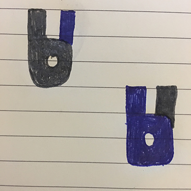

This repo contains logo design ideas and digital sketches for a high school hackathon project.

The project they're working on is called 'BU' ( be you ) an app that uses natural language analysis to help you understand how you're framed in social media. The team cleverly used the letters b and u together to form a logo ...

These are the original sketches of the logo idea

[1] faithful to original sketch 1

[2] faithful to original sketch 2

[3] trying the arch of the 'b' behind the 'u'

[4] trying a smaller 'b' within the 'u'

[5] rotating the 'u' 45 degrees - to break out a 'rock and roll' hand gesture

[6] tilting the b 22.5 degrees and the 'u' 45 degrees - to emphasize the 'rock and roll' hand gesture

[7] uniform color for version 6 - the shape feels strong enough to carry the letters and gesture

